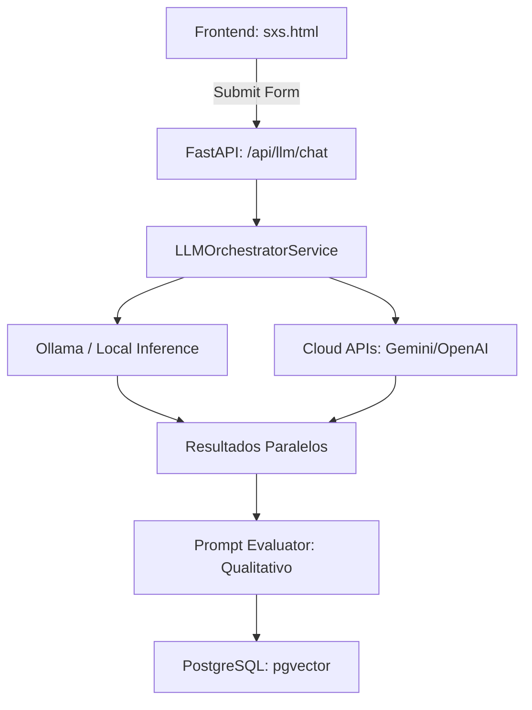

# 🏛️ Arquitetura do Sistema: Second Brain App

O **Second Brain App** foi projetado seguindo princípios de **Domain-Driven Design (DDD)** e **Clean Architecture**, garantindo que a lógica de experimentação científica seja independente de provedores específicos de LLM ou infraestrutura de banco de dados.

## 1. Fluxo de Dados SxS (Side-by-Side)

### Orquestração de Inferência
O coração do sistema é o `LLMOrchestratorService`. Ele gerencia chamadas simultâneas (paralelas) para dois modelos diferentes. Se um modelo for prefixado com `local:`, ele utiliza o motor de inferência direto (`SentenceTransformers`); caso contrário, roteia via API (Ollama ou Cloud).

## 2. Estrutura de Pastas

- **`/app`**: Código fonte principal.
    - **`/api`**: Rotas REST (FastAPI). Define os contratos de entrada e saída.
    - **`/core`**: Configurações globais e segurança (`config.py`).
    - **`/services`**: Lógica de negócio pesada (RAG Pipeline, LLM Orchestrator).
    - **`/repositories`**: Camada de persistência (SQL bruto com `psycopg2` para máxima performance em vetores).
    - **`/schemas`**: Modelos de dados Pydantic.
- **`/web`**: Interface Single Page Application (SPA) em Vanilla JS para máxima performance visual.
- **`/models`**: Repositório de pesos de modelos locais (blobs do SentenceTransformers).

## 3. Mecanismo de RAG (Retrieval-Augmented Generation)

O sistema utiliza o operador `<=>` (Cosine Distance) do **pgvector** para encontrar os fragmentos de documentos mais relevantes. 
1. O texto é convertido em vetor através do `generate_embeddings`.
2. O repositório realiza uma busca semântica filtrada por `embedding_model` e `corpus_version`.
3. O contexto recuperado é injetado no System Prompt antes da inferência do LLM.

## 4. Segurança e Segredos

- **Sem Hardcoding**: Nenhuma chave ou DSN de banco está no código. Tudo é carregado via `.env`.
- **Git Hygiene**: O arquivo `.gitignore` está configurado para nunca subir modelos binários, logs ou segredos.
