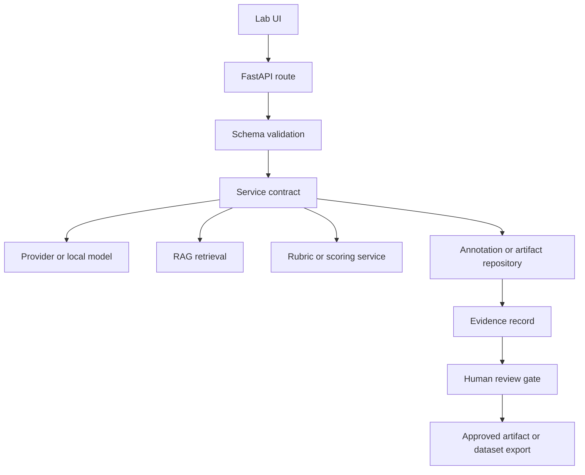

# Second Brain Architecture

Second Brain is an AI evaluation and training lab built around explicit
contracts, evidence, human review, and provenance. It is intentionally not an
autonomous agentic system.

The current architecture should be understood as a lab stack:

- run controlled experiments;
- compare model or prompt outputs;
- retrieve and trace RAG context;
- generate and validate rubrics;
- collect human preference evidence;
- export approved datasets;
- record provenance and verification metadata;
- allow Hermes to observe or advise only under explicit mode contracts.

The canonical operating model is:

- [Second Brain Lab Operating Model](docs/second_brain_lab_operating_model.md)

## 1. Lab Layers

```text
web UI
  -> FastAPI routes
    -> Pydantic schemas
      -> service layer
        -> repositories
          -> PostgreSQL / pgvector / local files
```

### Routes

Routes define HTTP-facing contracts and should avoid embedding lab policy.
Policy belongs in schemas, services, contracts, or operating-model documents.

### Schemas

Schemas define request and response shape. They are the first executable layer
of contract discipline.

### Services

Services implement lab behavior:

- inference orchestration;
- RAG retrieval and trace persistence;
- rubric generation, validation, scoring, and review support;
- annotation export;
- SMFP provenance;
- Hermes advisory diagnostics.

### Repositories

Repositories own persistence and retrieval details, including SQL and
`pgvector` similarity search.

## 2. Core Experiment Flow


```mermaid
graph TD
    A[Lab UI] --> B[FastAPI route]
    B --> C[Schema validation]
    C --> D[Service contract]
    D --> E[Provider or local model]
    D --> F[RAG retrieval]
    D --> G[Rubric or scoring service]
    D --> H[Annotation or artifact repository]
    H --> I[Evidence record]
    I --> J[Human review gate]
    J --> K[Approved artifact or dataset export]
```

An experiment is not automatically evidence. Evidence is produced only when the
run has enough context, traceability, validation, and review state for later use.

## 3. SxS And Preference Data

Side-by-Side evaluation compares two candidate outputs or two prompt/model
configurations under controlled parameters.

The lab supports:

- blind evaluation;
- model reveal after submission;
- qualitative rationale;
- rubric-assisted candidate scoring;
- SFT export from accepted examples;
- DPO-style export from chosen/rejected pairs.

A chosen/rejected pair is dataset-eligible only when it comes from real scoring
or explicit human annotation. Synthetic baselines must not be invented to fill
missing preference pairs.

## 4. RAG

The RAG pipeline uses `pgvector` for semantic retrieval and records retrieval
traces so later evaluation can inspect what context was available.

Retrieval must preserve:

- query or embedding model;
- corpus version;
- document source;
- title and section metadata;
- rank;
- similarity score;
- selected-for-prompt state;
- chunk text and token count.

RAG output is context evidence, not truth. It may support an experiment, but it
does not by itself approve an answer, rubric, or dataset item.

## 5. Rubric Lifecycle

Rubric behavior is governed by:

- [Localization Rubric Lab Contract](docs/localization_rubric_lab_contract.md)

Rubrics move through explicit states:

- `template_scaffold`
- `draft`
- `ai_generated`
- `human_reviewed`
- `approved`
- `blocked`

Only approved rubrics can support dataset promotion or training-quality claims.

## 6. Provenance

SMFP provides a provenance-first path for synthetic media artifacts:

```text
input -> SHA-256 hash -> Ed25519 signature -> manifest -> signed revision chain -> public verification -> trust score
```

See:

- [SMFP v1](docs/smfp_v1.md)

Provenance establishes identity and revision history. It does not replace human
review or quality validation.

## 7. Hermes

Hermes is governed by:

- [ADR 0001: The Hermes Fallacy](docs/adr_0001_the_hermes_fallacy.md)
- [Hermes Advise Contract](docs/hermes_advise_contract.md)
- [Hermes Advise Cooldown](docs/hermes_advise_cooldown.md)

Hermes has three conceptual modes:

- **Observe:** expose operational state without recommending, deciding, or
  executing.
- **Advise:** interpret experiment context and recommend next actions without
  side effects.
- **Act:** execute with limited autonomy, permission scope, audit trail, and
  approval gates. This remains out of scope.

Current implementation status:

- Hermes v0 remains archived and outside main navigation.
- Hermes Advise is deterministic and advisory-only.
- Hermes Observe is contract draft only.
- Hermes Act is not implemented.

## 8. Atlas OS Relationship

Atlas OS should be born later as an operational layer above evidence validated
inside Second Brain.

The intended relationship:

- **Second Brain:** tests, measures, evaluates, generates datasets, calibrates
  rubrics, and audits.
- **Hermes:** observes and advises inside the lab.
- **Atlas OS:** uses validated knowledge to operate real workflows with
  permissions, memory, tools, and human gates.

Second Brain trains trust. Atlas OS spends trust.

## 9. Security And Secrets

- Secrets and DSNs are loaded through environment configuration.
- Binary models, logs, and local artifacts should not be committed.
- Provider fallback must be explicit and auditable where supported.
- Silent model substitution is prohibited in lab-governed flows.

## 10. Non-Goals

Second Brain does not:

- act autonomously on business workflows;
- hide model or provider fallback;
- treat parseable JSON as quality approval;
- treat temporary diagnostics as audit evidence;
- promote unreviewed artifacts into datasets;
- merge Hermes Observe or Act behavior into Advise.
