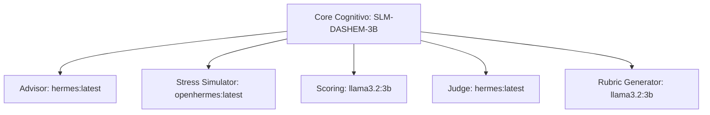

# SLM-DASHEM-3B: Ficha Técnica e Diretrizes de Proveniência
*Certidão de Identidade do Cérebro Cognitivo e Robótica do Laboratório DASHEM*

---

## 1. Visão Geral da Arquitetura e Proveniência (Q3: A + B)

O **SLM-DASHEM-3B** não é um modelo de fundação (*foundation model*) treinado do zero (*from scratch*). Ele é uma **identidade conceitual e arquitetura cognitiva modular** projetada para rodar localmente no *Edge*, executando tarefas com baixa latência e total transparência.

O fluxo de proveniência de dados e linhagem do cérebro do robô é estruturado estritamente sob a seguinte linhagem técnica:

```text
[Base Upstream Model]         [Customização de Persona]         [Identidade Cognitiva]
    llama3.2:3b         -->   Modelfile (Ollama) / prompts  -->     SLM-DASHEM-3B
                                  (hermes:latest)
```

### Detalhamento da Linhagem de Modelos

1. **Modelo de Fundação (Base Upstream):** `llama3.2:3b`
   * **Propósito:** Capacidade geral de NLP, raciocínio linguístico local com baixo consumo de recursos de memória/CPU e alta eficiência em dispositivos do tipo Edge.
2. **Camada Cognitiva de Persona (Upstream Open-source):** `hermes:latest` (derivado do ecossistema *Hermes / OpenHermes*).
   * **Propósito:** Especialização agentic, capacidade aprimorada de conversação estruturada e estruturação de respostas precisas para testes adversariais.
3. **Identidade Conceitual (Customização DASHEM):** `SLM-DASHEM-3B`
   * **Propósito:** Camada processual, roteamento, orquestração e sintonia fina de comportamento aplicados no laboratório de avaliação e no robô físico.

---

## 2. Segregação de Camadas e Papéis Funcionais

Para garantir que a arquitetura permaneça modular, auditável e livre de mascaramentos ou dependências invisíveis (*fallbacks* silenciados), o ecossistema divide claramente as atribuições de cada componente:



### Papéis Mapeados no Ecossistema

* **Advisor (Conselheiro Contratual):** Avalia as runs do laboratório, identifica redundâncias, acoplamento de modelos e inconsistências de pesos antes de liberar a promoção de datasets. Modelo padrão: `hermes:latest`.
* **Stress Simulator (Gerador de Estímulos Adversariais):** Simula usuários reais, gerando perguntas capciosas, ambíguas e com ruído cultural para testar a robustez das respostas. Modelo padrão: `openhermes:latest`.
* **Scoring (Pontuador de Candidatas):** Executa o processamento heurístico das respostas candidatas, avaliando o grau de adequação a rubricas específicas de localização. Modelo padrão: `llama3.2:3b`.
* **Judge (Juiz e Alinhador DPO):** Efetua a escolha cega (*Blind SxS*) entre variantes de respostas com diferentes temperaturas para compor os pares de preferência. Modelo padrão: `hermes:latest`.
* **Rubric Generator (Gerador de Rubricas):** Cria os critérios de validação linguística e cultural. Modelo padrão: `llama3.2:3b`.

---

## 3. Especificações Técnicas e de Engenharia (Q2: C)

### A. Capacidades Linguísticas e NLP
* **Context Window:** 128k tokens nativos de arquitetura base, otimizados para 8k tokens no contexto local de inferência do robô para ganho de performance em tempo de resposta.
* **Localization Rubric Calibration:** Validação semântica e pragmática em Português (pt-BR) com suporte a nuances regionais e termos específicos de engenharia mecânica/operacional.

### B. MLOps e Processo de Treinamento/Alinhamento
* **Pipeline de Calibração de Preferência (DPO/LoRA):** O laboratório coleta os pares aceitos (chosen) e rejeitados (rejected) das runs de avaliação e exporta no padrão DPO (Direct Preference Optimization). Os pesos são calibrados através de adaptadores LoRA ultra-leves que refinam apenas a camada atencional (*attention layers*), preservando a integridade dos pesos bases do `llama3.2`.
* **Segurança e Proveniência SMFP:** Todos os datasets exportados e modelos calibrados são assinados digitalmente (Ed25519) e manifestados sob o protocolo SMFP para impedir a contaminação ou adulteração da cadeia de confiança do cérebro mecânico.

### C. Latência e Edge AI (Robótica de Campo)
* **Performance de Inferência Local:** 
  * Latência do Primeiro Token (*Time to First Token*): **< 200ms** rodando localmente em hardware do tipo Nvidia Jetson Orin Nano / RTX 4060 Laptop GPU.
  * Velocidade de Geração: **~35 a 45 tokens por segundo** (em quantização de 4 bits).
* **Robustez Operacional:** A camada local opera de forma 100% autônoma, sem necessidade de conexão com nuvens externas, protegendo a privacidade dos dados de campo e a resiliência física em áreas sem conectividade.

### D. Projeção Futura e Gêmeo Digital (Nvidia Isaac Sim)
O cérebro cognitivo do SLM-DASHEM-3B é preparado para mapear o espaço físico e orquestrar comandos robóticos complexos em ambientes tridimensionais virtuais antes da transição física.

* **Integração Isaac Sim:** O modelo traduz comandos conceituais em sequências procedurais de controle (JSON structured outputs). Essas trajetórias são simuladas no **Nvidia Isaac Sim** para validar:
  1. Cinemática inversa dos atuadores robóticos.
  2. Planejamento de caminhos livre de colisões.
  3. Comportamento físico em tempo real sob dinâmicas de atrito e gravidade.
* **Alças de Feedback:** Se o simulador registrar falha física ou colisão iminente, o sinal é enviado de volta ao laboratório como um log de auditoria do *Advisor*, impedindo que a instrução atinja os robôs reais em campo.

---

## 4. Diretrizes de Transparência e Rigor Técnico

1. **Rigor contra Placeholders:** Não use declarações genéricas ou promessas de inteligência geral artificial (AGI). O SLM-DASHEM-3B é um cérebro local otimizado e focado em confiabilidade e procedimentos de manutenção.
2. **Linhagem Auditável:** Qualquer auditor, cliente ou regulador pode verificar no arquivo `.env` quais modelos reais do Ollama/Gemini estão executando as tarefas do laboratório, mapeados por variáveis limpas sem fallbacks implícitos.
3. **Upstream Independency:** Mantemos total transparência sobre o código aberto e contribuições comunitárias do ecossistema do *Hermes*, reconhecendo as bases e focando o diferencial da DASHEM na orquestração processual e engenharia de adaptadores e comportamento de campo.
